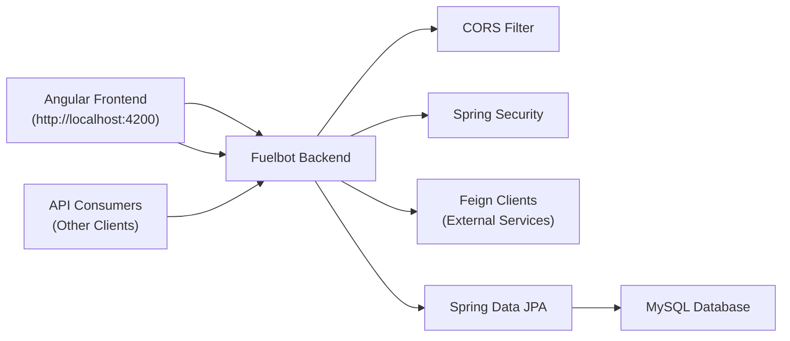

# Fuelbot Backend Module

## Overview
The Fuelbot Backend Module is a Spring Boot application that exposes REST APIs for managing fuel-related data, handles data persistence in MySQL, integrates with external services via Feign clients, and enforces security and CORS policies. It serves as the central backend service for the Fuelbot ecosystem and is typically consumed by a frontend application (e.g., an Angular client) and other downstream systems.

## Key Features
- **REST API Endpoints**: Provides HTTP endpoints for CRUD operations on fuel data and related entities.
- **Global CORS Configuration**: Configured to allow cross-origin requests from the Angular frontend (`http://localhost:4200`) for seamless integration.
- **Feign Client Integration**: Enables declarative HTTP clients to communicate with external microservices or third-party APIs.
- **Spring Security**: Applies authentication and authorization rules to secure endpoints.
- **Data Persistence with JPA**: Uses Spring Data JPA to interact with a MySQL database for storing and retrieving fuel records.

## System Errors
- **CORS Error (Missing Access-Control-Allow-Origin)**  
  Description: Browser blocks requests due to missing CORS headers.  
  Resolution: Verify that the `CorsFilter` bean is loaded and that `http://localhost:4200` is listed in `config.setAllowedOrigins(...)`.

- **Database Connection Failure**  
  Description: Application cannot connect to MySQL (`Communications link failure`).  
  Resolution: Check `application.properties` for correct JDBC URL, username, and password. Ensure the MySQL server is running and network-accessible.

- **Feign Client Timeout or 404**  
  Description: Feign client calls to external services fail or return 404.  
  Resolution: Confirm the external service’s base URL, endpoint paths, and network connectivity. Adjust timeouts in configuration if needed.

## Usage Examples

```bash
# Build and run the application
mvn clean package
mvn spring-boot:run
```

```bash
# Example HTTP request from a terminal or script
curl -X GET \
     -H "Accept: application/json" \
     http://localhost:8080/api/fuels
```

```typescript
// Example Angular service call (frontend)
this.http.get<Fuel[]>('http://localhost:8080/api/fuels')
  .subscribe(fuels => console.log('Fuel list:', fuels));
```

## System Integration
