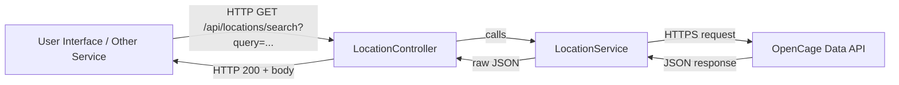

# Location Module

## Overview
The Location module provides a simple geocoding feature: it exposes a REST endpoint that accepts a free-form location query and returns raw JSON results from the OpenCage Data API. This module sits between your application’s user interface (or other services) and the external geocoding provider, abstracting away HTTP calls and API-key management.

## Key Features
- **Search Location**:  
  Exposes `GET /api/locations/search?query={text}` to retrieve up to 5 geocoding matches for the given query string.
- **API Key Injection**:  
  Reads `opencage.api.key` from application configuration, so you only need to supply your OpenCage Data API key in `application.properties` or environment variables.
- **External Service Integration**:  
  Delegates all geocoding logic to the external OpenCage Data API, returning the raw JSON response for downstream parsing or display.

## System Errors
- **MissingQueryParameter**  
  HTTP 400 Bad Request if the `query` parameter is absent.  
  Resolution: Always supply `?query=some+address` when calling the endpoint.
- **ExternalApiFailure**  
  HTTP 502 Bad Gateway if the call to OpenCage Data times out or returns a non-2xx status.  
  Resolution: Verify network connectivity, ensure API key is valid, and check OpenCage service status.
- **InternalServerError**  
  HTTP 500 Internal Server Error if any unexpected exception occurs (e.g., JSON parsing issue).  
  Resolution: Inspect server logs for stack traces and validate application configuration.

## Usage Examples
```bash
# Using curl to fetch geocoding results
curl -X GET "https://your-host/api/locations/search?query=1600+Amphitheatre+Parkway"
```

```java
// Using Spring's RestTemplate to call your LocationController
RestTemplate rest = new RestTemplate();
String url = "https://your-host/api/locations/search?query=Eiffel+Tower";
ResponseEntity<String> response = rest.getForEntity(url, String.class);
String jsonBody = response.getBody();
// jsonBody now contains the raw OpenCage JSON response
```

## System Integration
