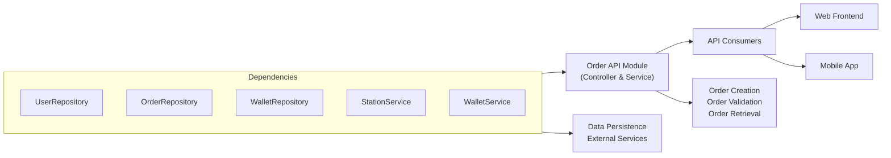

# Order API

## Overview
The Order API module manages fuel order lifecycles, from creation through validation to retrieval. It exposes REST endpoints for clients (web and mobile) to:
- Create a new fuel order by reserving funds and checking fuel availability
- Validate an existing order, finalize payment, and update statuses
- Fetch all orders associated with a given user

This module sits between the presentation layer (HTTP controllers) and the data/external service layers (repositories and station/wallet services).

## Key Features
- **Create Order**  
  Accepts user ID, station ID, fuel type, and quantity.  
  Verifies user existence, fuel availability, and user wallet balance.  
  Reserves funds, records the order, and returns order summary with status “EN_ATTENTE”.

- **Validate Order**  
  Accepts an order ID.  
  Ensures the order exists and is not already validated.  
  Checks wallet balance, deducts final amount, and updates order status to “VALIDÉE”.

- **Get Orders by User**  
  Accepts a user ID.  
  Retrieves all orders placed by the user.  
  Returns a list of order details, including status and pricing.

## System Errors
- **Utilisateur non trouvé**  
  Thrown when the provided userId does not match any registered user.  
  HTTP Response: 400 Bad Request, with an error payload indicating “Utilisateur non trouvé”.

- **Carburant non disponible**  
  Thrown when the requested fuel type or quantity is not available at the station.  
  HTTP Response: 400 Bad Request, with “Carburant non disponible”.

- **Solde insuffisant pour cette commande**  
  Thrown when the user’s wallet balance is lower than the calculated order total.  
  HTTP Response: 400 Bad Request, with “Solde insuffisant pour cette commande”.

- **Commande non trouvée**  
  Thrown when attempting to validate an order ID that does not exist.  
  HTTP Response: 400 Bad Request, with “Commande non trouvée”.

- **La commande est déjà validée**  
  Thrown if validation is called on an order already marked as “VALIDÉE”.  
  HTTP Response: 400 Bad Request, with “La commande est déjà validée”.

- **Aucun portefeuille associé à cet utilisateur**  
  Thrown when no wallet is found for the order’s user during validation.  
  HTTP Response: 400 Bad Request, with “Aucun portefeuille associé à cet utilisateur”.

- **Fonds insuffisants pour valider la commande**  
  Thrown when the wallet balance is insufficient to finalize payment.  
  HTTP Response: 400 Bad Request, with “Fonds insuffisants pour valider la commande”.

## Usage Examples

```bash
# 1. Create a new order
curl -X POST http://localhost:8080/api/orders/createOrder \
  -H "Content-Type: application/json" \
  -d '{
        "utilisateurId": 1,
        "stationId": 42,
        "fuelType": "diesel",
        "fuelQuantity": 20.5
      }'

# Expected Response (200 OK)
{
  "idCommande": 123,
  "orderDate": "2024-06-01T10:15:30",
  "nomUtilisateur": "Doe",
  "station": "Station Centrale",
  "fuelType": "Gazole",
  "fuelQuantity": 20.5,
  "totalPrice": "50.75 €",
  "orderStatus": "EN_ATTENTE"
}

# 2. Validate an existing order
curl -X PATCH "http://localhost:8080/api/orders/validateOrder?id=123"

# Expected Response (200 OK)
"Commande validée avec succès."

# 3. Retrieve orders by user
curl -X GET "http://localhost:8080/api/orders/user?userId=1"

# Expected Response (200 OK)
[
  {
    "idCommande": 123,
    "station": "Station Centrale",
    "fuelType": "Gazole",
    "fuelQuantity": 20.5,
    "totalPrice": "50.75 €",
    "orderStatus": "VALIDÉE",
    "orderDate": "2024-06-01T10:15:30"
  },
  {
    "idCommande": 124,
    "station": "Station Nord",
    "fuelType": "Super Sans Plomb 95 E10",
    "fuelQuantity": 10.0,
    "totalPrice": "15.00 €",
    "orderStatus": "EN_ATTENTE",
    "orderDate": "2024-06-02T14:20:00"
  }
]
```

## System Integration

