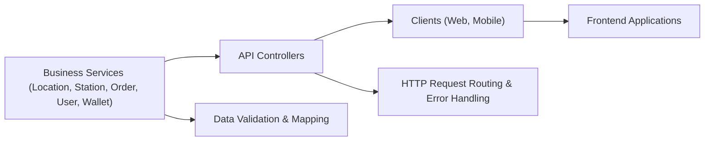

# FuelBot API Module

## Overview
The FuelBot API Module exposes RESTful endpoints that enable client applications to interact with the FuelBot backend. It provides a cohesive set of controllers for:
- User account management (creation, login, profile updates, password reset)
- Location searches for addresses
- Station discovery and details
- Order processing and validation
- Wallet deposit and balance retrieval

This module orchestrates HTTP request routing, input validation, error handling, and delegates business logic to underlying services.

## Key Features
- **User Account Management**:  
  - Create new user accounts  
  - Authenticate existing users  
  - Update user profiles  
  - Reset user passwords  

- **Location Search**:  
  - Search for addresses or places via text queries  

- **Station Discovery**:  
  - Search stations by address and optional fuel type  
  - Retrieve nearby stations based on latitude/longitude  
  - Fetch detailed station summary by station ID  

- **Order Processing**:  
  - Create new fuel orders  
  - Validate pending orders  
  - Retrieve orders by user ID  

- **Wallet Management**:  
  - Deposit funds into user wallets  
  - Retrieve current wallet balance  

## System Errors
- **BadRequest (400)**:  
  - Occurs when required parameters are missing or invalid (e.g., creating an order with invalid data, depositing a negative amount).  
  - Resolution: Verify request payloads and query parameters for correctness.

- **NotFound (404)**:  
  - Triggered when a wallet balance is requested for a non-existent user.  
  - Resolution: Ensure the `userId` refers to a valid, existing user.

- **InternalServerError (500)**:  
  - Returned when retrieving orders by user fails unexpectedly.  
  - Resolution: Check service logs for underlying exceptions and ensure database connectivity.

## Usage Examples
```bash
# 1. Search for a location
curl -X GET "http://localhost:8080/api/locations/search?query=Eiffel%20Tower"

# 2. Search stations near an address
curl -X GET "http://localhost:8080/api/stations/search?query=Paris&fuelType=Diesel"

# 3. Get nearby stations by coordinates
curl -X GET "http://localhost:8080/api/stations/nearbyStations?lat=48.8566&lon=2.3522"

# 4. Get station details
curl -X GET "http://localhost:8080/api/stations/stationDetails?id=123"

# 5. Create a new order
curl -X POST "http://localhost:8080/api/orders/createOrder" \
     -H "Content-Type: application/json" \
     -d '{"userId":1,"stationId":123,"fuelType":"Diesel","quantity":50}'

# 6. Validate an order
curl -X PATCH "http://localhost:8080/api/orders/validateOrder?id=456"

# 7. Retrieve orders for a user
curl -X GET "http://localhost:8080/api/orders/user?userId=1"

# 8. Create a user account
curl -X POST "http://localhost:8080/api/utilisateur/create?nom=Doe&prenom=John&email=john.doe@example.com&motDePasse=secret"

# 9. Login
curl -X POST "http://localhost:8080/api/utilisateur/login?email=john.doe@example.com&motDePasse=secret"

# 10. Update user profile
curl -X PUT "http://localhost:8080/api/utilisateur/update/john.doe@example.com" \
     -H "Content-Type: application/json" \
     -d '{"nom":"Doe","prenom":"Johnny"}'

# 11. Deposit into wallet
curl -X POST "http://localhost:8080/api/wallet/deposit" \
     -H "Content-Type: application/json" \
     -d '{"userId":1,"amount":100.0}'

# 12. Get wallet balance
curl -X GET "http://localhost:8080/api/wallet/solde?userId=1"
```

## System Integration
