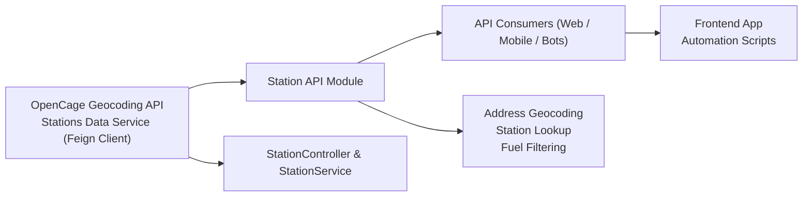

# Station API Module

## Overview  
The Station API Module exposes REST endpoints for searching and retrieving fuel station information. It integrates with an external geocoding service to translate addresses into coordinates and with a downstream stations data service to fetch nearby station listings and detailed station summaries. This module serves frontend clients, automation scripts, or other backend services requiring station location or fuel availability data.

## Key Features  
- **Search Stations by Address**  
  Convert a user-supplied address into geographic coordinates via the OpenCage Geocoding API, fetch nearby stations, and optionally filter results by fuel type.

- **Nearby Station Lookup**  
  Retrieve a list of stations within proximity of a given latitude/longitude pair.

- **Station Details Retrieval**  
  Fetch a summary of a specific station, including name, brand, address, coordinates, and available fuels.

## System Errors  
- **GeocodingError**  
  Description: The OpenCage API call failed or returned no geometry results.  
  Resolution: Verify the geocoding API key, ensure the address is valid and properly URL-encoded, and check network connectivity.

- **NoStationsFound**  
  Description: No station entries are returned for the given coordinates or address.  
  Resolution: Confirm the input coordinates/address, broaden the search area, or retry later.

- **ExternalServiceError**  
  Description: The downstream stations data service (via Feign client) is unavailable or returned an error.  
  Resolution: Check the health and connectivity of the stations data service, inspect service logs, and ensure correct service URL and credentials.

- **InvalidStationId**  
  Description: A request for station details with a non-existent or malformed station ID.  
  Resolution: Validate the station ID on the caller side and handle the empty or error response appropriately.

## Usage Examples  
```bash
# Search by address (no fuel filter)
curl -X GET "https://api.yourdomain.com/api/stations/search?query=1600+Amphitheatre+Parkway"

# Search by address with fuel filter
curl -X GET "https://api.yourdomain.com/api/stations/search?query=1600+Amphitheatre+Parkway&fuelType=diesel"

# Get nearby stations by coordinates
curl -X GET "https://api.yourdomain.com/api/stations/nearbyStations?lat=37.4220&lon=-122.0841"

# Get station summary by ID
curl -X GET "https://api.yourdomain.com/api/stations/stationDetails?id=12345"
```

## System Integration  
