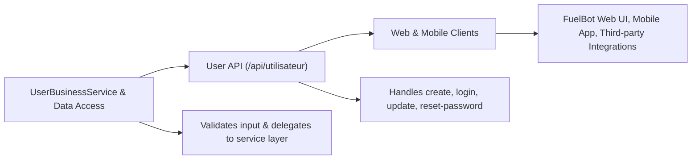

# User API

## Overview
The User API module exposes REST endpoints for managing user accounts in the FuelBot system. It handles user registration, authentication, profile updates, and password resets. This controller sits at the edge of the application, validating incoming HTTP requests and delegating business logic to the service layer.

## Key Features
- **Create Account**:  
  Endpoint: POST `/api/utilisateur/create`  
  Registers a new user by accepting `nom`, `prenom`, `email`, and `motDePasse` as request parameters. Returns the created `User` object on success.

- **Login**:  
  Endpoint: POST `/api/utilisateur/login`  
  Authenticates an existing user with `email` and `motDePasse`. Returns a `UserResponse` containing user details upon successful authentication.

- **Update User**:  
  Endpoint: PUT `/api/utilisateur/update/{email}`  
  Updates profile information for the user identified by the path variable `email`. Accepts a JSON payload (`UserUpdateRequest`) and returns a `UserUpdateResponse` with the updated data.

- **Reset Password**:  
  Endpoint: POST `/api/utilisateur/reset-password`  
  Generates a new password for the user with the given `email`. Returns a plain-text message containing the new password.

## System Errors
- **InvalidInputError**  
  Occurs when required parameters are missing or malformed (e.g., empty strings, invalid email format).  
  Resolution: Ensure all request parameters are provided and valid. The API responds with HTTP 400 and a descriptive message.

- **AuthenticationFailedError**  
  Happens if the provided credentials do not match any user on login.  
  Resolution: Verify email and password correctness. The API responds with HTTP 400 and “Invalid email or password.”

- **UserNotFoundError**  
  Thrown when attempting to update or reset the password of a non-existent user.  
  Resolution: Confirm the user’s email exists in the system. The API responds with HTTP 400 and “User not found.”

## Usage Examples
```bash
# Create a new user
curl -X POST "http://localhost:8080/api/utilisateur/create?nom=Doe&prenom=John&email=john.doe@example.com&motDePasse=secret"

# Login as an existing user
curl -X POST "http://localhost:8080/api/utilisateur/login?email=john.doe@example.com&motDePasse=secret"

# Update user profile
curl -X PUT "http://localhost:8080/api/utilisateur/update/john.doe@example.com" \
     -H "Content-Type: application/json" \
     -d '{
           "prenom": "Johnny",
           "motDePasse": "newSecret123"
         }'

# Reset user password
curl -X POST "http://localhost:8080/api/utilisateur/reset-password?email=john.doe@example.com"
```

## System Integration
