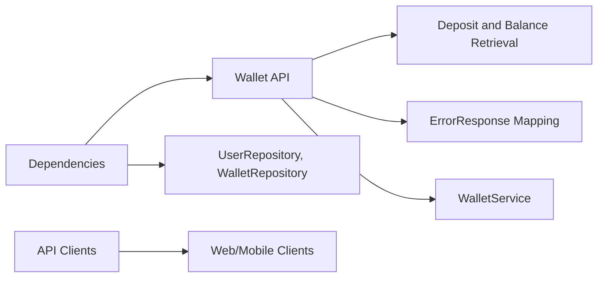

# Wallet API

## Overview
The Wallet API module provides endpoints to manage user wallets, enabling deposits and balance retrieval. It serves as the bridge between incoming client requests and the wallet service layer, ensuring funds can be credited to users and their current wallet balance can be fetched.

## Key Features
- **Deposit Funds**: Allows clients to credit a specified amount to a user's wallet.
- **Retrieve Balance**: Returns the current balance for a given user wallet.

## System Errors
- **InvalidArgument for Deposit**:  
  Description: Thrown when the user does not exist or the deposit amount is invalid.  
  Resolution: Verify the userId is correct and the amount is a positive value.  
- **Wallet Not Found**:  
  Description: Thrown when no wallet is found for the specified user during balance retrieval.  
  Resolution: Ensure a wallet has been created for the user or create one via a deposit operation.

## Usage Examples
```http
POST /api/wallet/deposit
Content-Type: application/json

{
  "userId": 123,
  "amount": 50.0
}

Response 200 OK
{
  "message": "Dépôt effectué avec succès."
}
```

```http
GET /api/wallet/solde?userId=123

Response 200 OK
{
  "userId": 123,
  "balance": 150.0
}
```

```http
GET /api/wallet/solde?userId=999

Response 404 Not Found
{
  "timestamp": "2024-06-01T12:00:00",
  "status": 404,
  "error": "Solde indisponible",
  "message": "Aucun portefeuille trouvé pour cet utilisateur.",
  "path": "/api/wallet/solde"
}
```

## System Integration
