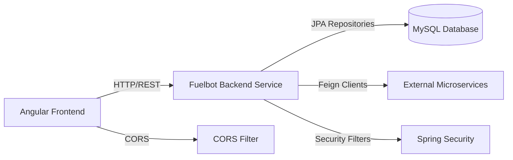

# Fuelbot Backend Service

## Overview
The Fuelbot Backend Service is a Spring Boot–based microservice that provides the core server-side functionality for the Fuelbot application. It exposes RESTful HTTP endpoints for client applications, handles data persistence with MySQL, enforces security policies, and invokes external services via OpenFeign. Global CORS configuration enables smooth communication with the Angular frontend.

## Key Features
- **Spring Boot Application**: Bootstraps the Fuelbot backend with embedded Tomcat and auto-configuration.
- **REST API Endpoints**: Exposes controllers (via `spring-boot-starter-web`) for client interactions.
- **Data Persistence**: Uses Spring Data JPA (`spring-boot-starter-data-jpa` and MySQL connector) for ORM and transaction management.
- **Security**: Integrates Spring Security (`spring-boot-starter-security`) for authentication and authorization.
- **OpenFeign Clients**: Enables declarative REST clients (`spring-cloud-starter-openfeign`) to communicate with external microservices.
- **Global CORS Configuration**: Defines a `CorsFilter` bean to allow cross-origin requests from the Angular frontend (`http://localhost:4200`).

## System Errors
- **Database Connection Failure**  
  Description: The service cannot connect to the MySQL database (e.g., wrong URL, credentials, or database down).  
  Resolution: Verify `spring.datasource.url`, `spring.datasource.username`, `spring.datasource.password` in `application.properties` and ensure the MySQL server is running and accessible.

- **CORS Rejection**  
  Description: Browser clients receive CORS errors when calling the API.  
  Resolution: Confirm the `CorsFilter` bean is registered and that `allowedOrigins`, `allowedMethods`, and `allowedHeaders` include the client domain and required methods/headers.

- **Feign Client Timeout/Failure**  
  Description: Requests to external services fail due to timeouts or misconfiguration.  
  Resolution: Check Feign client configuration in properties (e.g., timeouts), ensure target service URLs are correct, and that the external services are operational.

- **Authentication/Authorization Errors**  
  Description: Unauthorized or forbidden errors when accessing secured endpoints.  
  Resolution: Review Spring Security configuration, JWT or session settings, and ensure the client sends valid credentials or tokens.

## Usage Examples
To launch the Fuelbot Backend locally:

```bash
# From the project root
mvn clean spring-boot:run
```

Sample cURL request to a hypothetical REST endpoint:

```bash
curl -X GET \
  http://localhost:8080/api/fuel/status \
  -H "Authorization: Bearer <your-jwt-token>" \
  -H "Accept: application/json"
```

## System Integration


In this architecture:
- The Angular frontend issues HTTP requests to the Fuelbot Backend.
- Global CORS settings allow cross-origin calls from `http://localhost:4200`.
- Spring Security enforces authentication/authorization on incoming requests.
- Fuelbot Backend persists and retrieves data from a MySQL database via JPA.
- External services are invoked through OpenFeign clients.