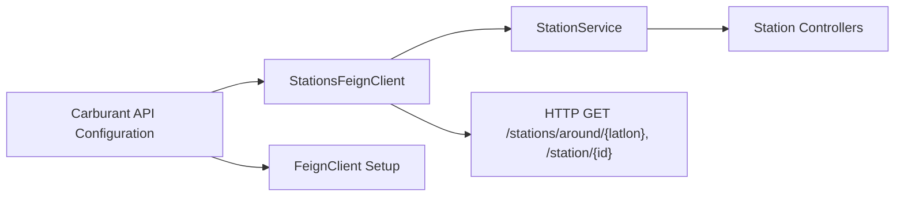

# External Station API Client

## Overview
The External Station API Client integrates with the Carburant external service to retrieve fuel station information. It exposes methods to fetch nearby stations based on geographic coordinates and to obtain detailed data for a specific station. This module is used by the core station service layer to abstract external API calls and centralize configuration.

## Key Features
- **getStations**: Fetches a list of stations around a given latitude-longitude coordinate.  
- **getStationDetails**: Retrieves detailed information for a single station by its unique ID.

## System Errors
- **Remote Service Unavailable**  
  Description: Feign throws a connection or retryable exception when the external API is down or unreachable.  
  Resolution: Verify that `carburant.api.url` is correct, ensure network connectivity, and confirm the external service is running.

- **404 Not Found**  
  Description: The external API returns 404 when the requested station ID does not exist.  
  Resolution: Validate station IDs before invoking the client or handle empty results gracefully.

- **Timeout**  
  Description: Calls may timeout if the external API is slow or unresponsive.  
  Resolution: Adjust Feign timeout settings in `application.yml` or `application.properties`.

- **Unauthorized (401)**  
  Description: The external API requires authentication, but no credentials or invalid credentials are provided.  
  Resolution: Configure authentication headers or tokens in the Feign client configuration.

## Usage Examples
```java
import backend.fuelbotbackend.core.station.api.StationsFeignClient;
import backend.fuelbotbackend.core.station.dto.StationDetailsResponse;
import backend.fuelbotbackend.core.station.model.Stations;
import org.springframework.stereotype.Service;
import java.util.List;

@Service
public class StationService {
    private final StationsFeignClient stationsFeignClient;

    public StationService(StationsFeignClient stationsFeignClient) {
        this.stationsFeignClient = stationsFeignClient;
    }

    public List<Stations> findNearbyStations(double latitude, double longitude) {
        String latlon = latitude + "," + longitude;
        return stationsFeignClient.getStations(latlon);
    }

    public StationDetailsResponse getStationDetails(long stationId) {
        return stationsFeignClient.getStationsDetails(stationId);
    }
}
```

## System Integration
