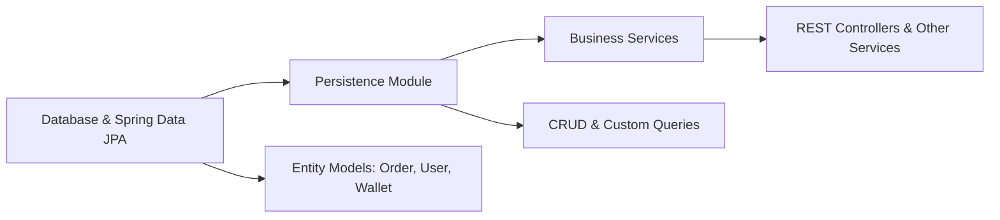

# Persistence Module

## Overview
The Persistence Module centralizes all database interactions for core entities (Order, User, Wallet) using Spring Data JPA. It provides a clean, repository-based API for CRUD operations and custom queries, decoupling business logic from data-access concerns.

## Key Features
- **OrderRepository**:  
  - CRUD operations for Order entities  
  - `findByUserIdUtilisateur(Long idUtilisateur)`: Retrieve all orders placed by a specific user

- **UserRepository**:  
  - CRUD operations for User entities  
  - `findByEmail(String email)`: Fetch a user by their unique email address

- **WalletRepository**:  
  - CRUD operations for Wallet entities  
  - `findByUserIdUtilisateur(Long idUtilisateur)`: Get the wallet associated with a given user

## System Errors
- **DataAccessException**  
  Description: Generic exception thrown on any database access error (timeouts, connectivity issues).  
  Resolution: Verify database connection settings, network availability, and review SQL logs.

- **EmptyResultDataAccessException**  
  Description: Thrown when a query expecting a result returns none (e.g., finding a wallet for a non-existent user).  
  Resolution: Check that the user or entity exists before querying; handle empty returns with Optional or null checks.

- **DataIntegrityViolationException**  
  Description: Raised on constraint violations (unique email constraint, foreign-key violations).  
  Resolution: Ensure entity data respects database constraints; validate uniqueness in service layer before saving.

## Usage Examples
```java
@Service
public class OrderService {
    private final OrderRepository orderRepository;

    public OrderService(OrderRepository orderRepository) {
        this.orderRepository = orderRepository;
    }

    public List<Order> getOrdersForUser(Long userId) {
        return orderRepository.findByUserIdUtilisateur(userId);
    }
}
```

```java
@Service
public class UserService {
    private final UserRepository userRepository;
    private final WalletRepository walletRepository;

    public UserService(UserRepository userRepository, WalletRepository walletRepository) {
        this.userRepository = userRepository;
        this.walletRepository = walletRepository;
    }

    public User registerUser(User user) {
        userRepository.findByEmail(user.getEmail())
            .ifPresent(u -> { throw new IllegalArgumentException("Email already in use"); });
        return userRepository.save(user);
    }

    public Wallet getUserWallet(Long userId) {
        return walletRepository.findByUserIdUtilisateur(userId);
    }
}
```

## System Integration
