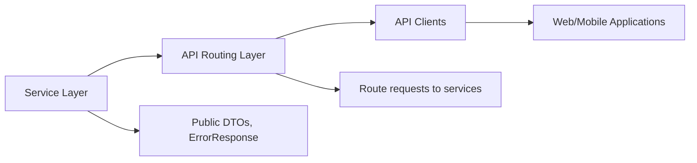

# API Routing Guide

## Overview
This document outlines the REST API routing layer for FuelBot Backend. It lists all publicly exposed endpoints, their purposes, HTTP methods, and integration points. Use this guide to understand which routes to call, what parameters to provide, and how errors are surfaced.

## Key Features
- **Location Search**  
  GET /api/locations/search?query={address}  
  Returns a formatted location string for a user-provided query.

- **Station Search**  
  GET /api/stations/search?query={address}[&fuelType={type}]  
  Finds fuel stations near a given address, optionally filtered by fuel type.

- **Nearby Stations**  
  GET /api/stations/nearbyStations?lat={latitude}&lon={longitude}  
  Retrieves stations close to specific geographic coordinates.

- **Station Details**  
  GET /api/stations/stationDetails?id={stationId}  
  Provides detailed summary information about a single station.

- **Create Order**  
  POST /api/orders/createOrder  
  Submits a new fuel order. Expects a JSON payload matching `CreateOrderRequest`.

- **Validate Order**  
  PATCH /api/orders/validateOrder?id={orderId}  
  Marks an existing order as validated.

- **Get User Orders**  
  GET /api/orders/user?userId={userId}  
  Fetches all orders associated with the specified user.

- **User Account Creation**  
  POST /api/utilisateur/create?nom={lastName}&prenom={firstName}&email={email}&motDePasse={password}  
  Registers a new user account.

- **User Login**  
  POST /api/utilisateur/login?email={email}&motDePasse={password}  
  Authenticates a user and returns their profile.

- **Update User**  
  PUT /api/utilisateur/update/{email}  
  Updates user attributes based on JSON payload `UserUpdateRequest`.

- **Reset Password**  
  POST /api/utilisateur/reset-password?email={email}  
  Generates and returns a new password for the given email.

- **Wallet Deposit**  
  POST /api/wallet/deposit  
  Adds funds to a user’s wallet. Expects `WalletDepositRequest` JSON.

- **Get Wallet Balance**  
  GET /api/wallet/solde?userId={userId}  
  Retrieves current balance for a user’s wallet.

## System Errors
- **400 Bad Request (IllegalArgumentException)**  
  Triggered when required parameters are missing or invalid.  
  Resolution: Validate request parameters and payload before calling the endpoint.

- **404 Not Found (Wallet Solde)**  
  Returned when querying wallet balance for a non-existent user.  
  Resolution: Ensure the userId exists and the wallet has been initialized.

- **500 Internal Server Error (Order Retrieval Failure)**  
  Occurs if the system cannot fetch orders due to database or service errors.  
  Resolution: Check service availability, database connectivity, and server logs.

Each error response uses the `ErrorResponse` format:
```json
{
  "timestamp": "2024-06-01T12:00:00",
  "status": 400,
  "error": "Bad Request",
  "message": "Detailed error message",
  "path": "/api/orders/createOrder"
}
```

## Usage Examples
```http
# Search for a location
GET /api/locations/search?query=1600+Amphitheatre+Parkway HTTP/1.1
Host: api.fuelbot.example.com

# Create a new order
POST /api/orders/createOrder HTTP/1.1
Host: api.fuelbot.example.com
Content-Type: application/json

{
  "userId": 42,
  "stationId": 7,
  "fuelType": "GASOIL",
  "quantity": 50.0
}

# Validate an order
PATCH /api/orders/validateOrder?id=123 HTTP/1.1
Host: api.fuelbot.example.com

# User login
POST /api/utilisateur/login?email=jane.doe@example.com&motDePasse=secret HTTP/1.1
Host: api.fuelbot.example.com

# Deposit into wallet
POST /api/wallet/deposit HTTP/1.1
Host: api.fuelbot.example.com
Content-Type: application/json

{
  "userId": 42,
  "amount": 100.00
}
```

## System Integration
