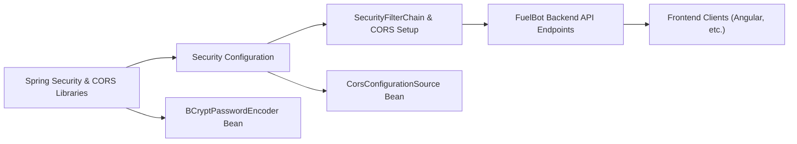

# Security Configuration

## Overview
The Security Configuration module defines the security policies and cross-origin resource sharing (CORS) rules for the FuelBot backend. It provides password encoding, sets up the Spring Security filter chain, disables CSRF protection for stateless interactions, and configures allowed origins, methods, and headers for incoming HTTP requests.

## Key Features
- **BCryptPasswordEncoder Bean**: Provides a BCrypt-based password hashing mechanism for secure storage and verification of user credentials.
- **SecurityFilterChain Bean**: Establishes global security settings, disabling CSRF protection and permitting all requests by default (intended for development or public API endpoints).
- **CORS Configuration Source Bean**: Defines allowed origin patterns (e.g., localhost:4200 and the production front-end URL), HTTP methods (GET, POST, PUT, DELETE, OPTIONS), headers (Origin, Content-Type, Accept, Authorization), and credentials support.

## System Errors
- **CORS Origin Not Allowed**  
  Description: Incoming requests from an origin not listed in the allowed origin patterns will be blocked by the browser.  
  Resolution: Ensure the request’s `Origin` header matches one of the configured patterns (`http://localhost:4200` or `https://fuelbot-front-production.up.railway.app`), or update the `corsConfigurationSource` to include additional origins.

- **Invalid Credentials Hashing**  
  Description: Attempts to verify a password against a BCrypt hash that is malformed or generated with a different salt/version can fail.  
  Resolution: Confirm that all stored password hashes were produced by the same `BCryptPasswordEncoder` instance and adhere to the expected format.

## Usage Examples
```java
// Injecting and using the password encoder
@Autowired
private BCryptPasswordEncoder passwordEncoder;

public void createUser(String rawPassword) {
    String hashed = passwordEncoder.encode(rawPassword);
    userRepository.save(new User(username, hashed));
}

// Standard HTTP request with CORS from frontend
fetch('https://fuelbot-back-production.up.railway.app/api/refuel', {
  method: 'POST',
  credentials: 'include',
  headers: { 'Content-Type': 'application/json' },
  body: JSON.stringify({ stationId: 123, liters: 50 })
})
.then(response => response.json())
.then(data => console.log(data));
```

## System Integration
