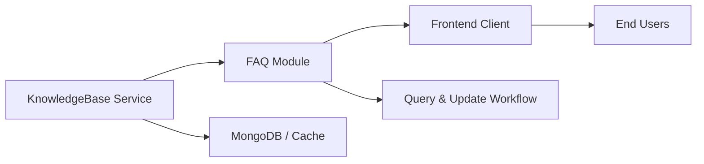

# FAQ Module

## Overview
The FAQ Module provides a centralized service for managing and serving Frequently Asked Questions within the Shelfya Starter application. It enables clients to retrieve, search, and maintain FAQ entries, ensuring end users have quick access to self-help content without direct backend intervention.

## Key Features
- **Retrieve All FAQs**: Fetch the complete list of FAQ entries in a single call.  
- **Get FAQ by ID**: Retrieve details for a specific FAQ item by its identifier.  
- **Search FAQs**: Perform keyword-based searches across questions and answers.  
- **Create / Update FAQ**: Add new FAQ entries or modify existing ones through a validated API.  
- **Delete FAQ**: Remove outdated or irrelevant FAQ entries safely, with integrity checks.

## System Errors
- **FAQNotFoundError**  
  Description: Thrown when a requested FAQ ID does not exist.  
  Resolution: Verify the FAQ identifier or refresh the list of available FAQs.

- **ValidationError**  
  Description: Raised if payloads for create/update operations fail schema validation.  
  Resolution: Ensure all required fields (question, answer) are present and correctly formatted.

- **DatabaseConnectionError**  
  Description: Occurs when the module cannot reach the FAQ datastore.  
  Resolution: Check database service health, network connectivity, and configuration parameters.

## Usage Examples
```javascript
// JavaScript / Node.js example
const faqModule = require('@shelfya/starter/faq');

async function demoFaqOperations() {
  // Fetch all FAQs
  const allFaqs = await faqModule.getAll();
  console.log('All FAQs:', allFaqs);

  // Get a specific FAQ
  const faq = await faqModule.getById('faq123');
  console.log('Single FAQ:', faq);

  // Search by keyword
  const matching = await faqModule.search('installation');
  console.log('Search results:', matching);

  // Add a new FAQ
  const newFaq = await faqModule.create({
    question: 'How do I reset my password?',
    answer: 'Go to Settings → Account → Reset Password and follow the prompts.'
  });
  console.log('Created FAQ:', newFaq);

  // Update an existing FAQ
  const updated = await faqModule.update('faq123', {
    answer: 'Visit your profile settings and click “Change Password”.'
  });
  console.log('Updated FAQ:', updated);

  // Delete an FAQ
  await faqModule.delete('faq123');
  console.log('FAQ faq123 deleted');
}

demoFaqOperations().catch(console.error);
```

## System Integration
