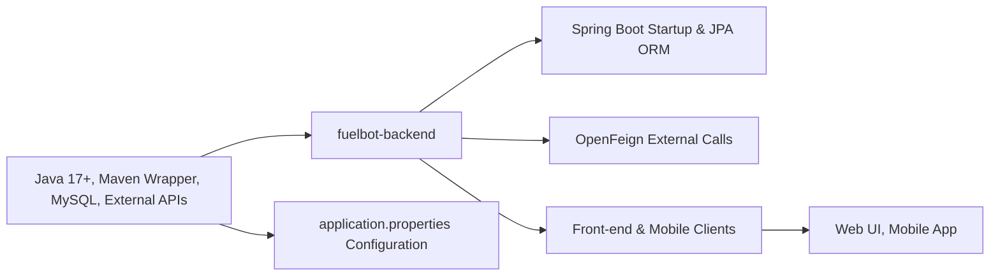

# Getting Started

## Overview
This guide covers how to set up and run the fuelbot-backend module, a Spring Boot–based REST API service that connects to a MySQL database and integrates with external fuel price and geocoding APIs. You will learn how to prepare your environment, configure the application, and launch the service.

## Key Features
- **Maven Wrapper Support**:  
  Ensures a consistent Maven version (`./mvnw`) across different environments without requiring a local Maven installation.  
- **Spring Boot Application**:  
  Auto-configures embedded Tomcat, dependency injection, and application lifecycle.  
- **REST API Endpoints**:  
  Exposes HTTP endpoints for retrieving fuel station data, current prices, and geolocation lookups.  
- **JPA-based MySQL Persistence**:  
  Uses Spring Data JPA and Hibernate to map domain models to tables in a MySQL database.  
- **Spring Security Integration**:  
  Provides pluggable authentication and authorization for your REST APIs.  
- **OpenFeign Client**:  
  Declaratively calls external services (fuel pricing API, geocoding API) via Feign interfaces.  

## System Errors
- **JavaNotFoundError**  
  Occurs if Java 17+ is not installed or not on PATH.  
  Resolution: Install JDK 17 or set `JAVA_HOME` to your JDK installation.  
- **DatabaseConnectionError**  
  Happens when the module cannot connect to the MySQL instance (invalid URL, credentials, or unreachable host).  
  Resolution: Verify `spring.datasource.*` properties in `application.properties` and ensure the MySQL server is accessible.  
- **PropertyMisconfigurationError**  
  Triggered by missing or malformed entries in `application.properties` (e.g., missing API keys).  
  Resolution: Populate `carburant.api.url`, `opencage.api.key`, and datasource settings correctly before startup.  
- **ExternalApiClientError**  
  Interfaces with the external fuel price or geocoding APIs may fail (timeout, authentication).  
  Resolution: Check network connectivity and validity of the external API endpoints and keys.  

## Usage Examples
```bash
# Clone the repository
git clone https://github.com/Nathapvv/fuelbot-back.git
cd fuelbot-back

# (Optional) Edit src/main/resources/application.properties 
# to match your MySQL URL, credentials, and API keys.

# 1. Run with Maven Wrapper
./mvnw spring-boot:run

# 2. Build a self-contained JAR
./mvnw clean package
java -jar target/fuelbot-backend-0.0.1-SNAPSHOT.jar
```

## System Integration
